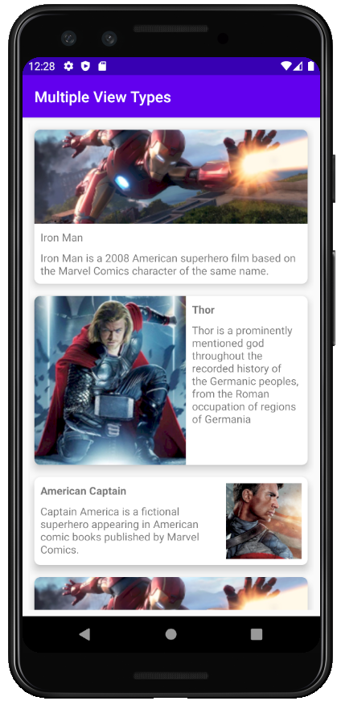
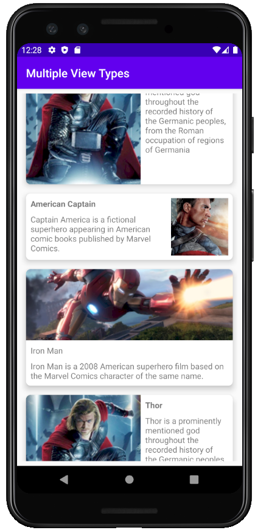

# MultipleViewTypes

### **Overview - About this project**
Simples project using **viewTypes** to handle different types of Views


### 📷 How is this App
</img>
</img>


### 💻Technology
- [Kotlin](https://kotlinlang.org/)

### Libraries
```bash
    implementation 'com.google.android.material:material:1.1.0'
 ```
